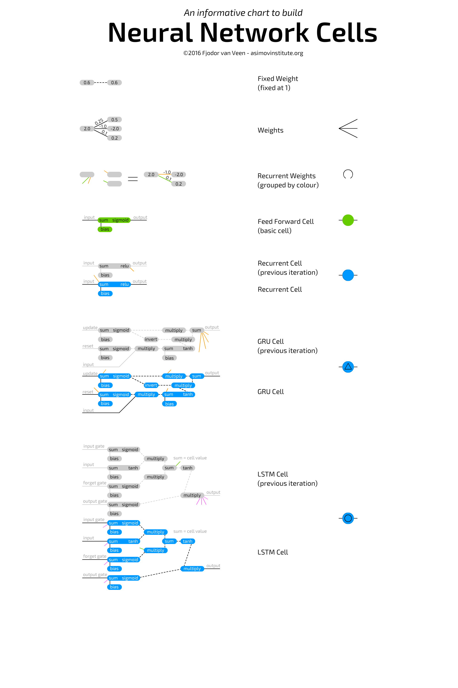
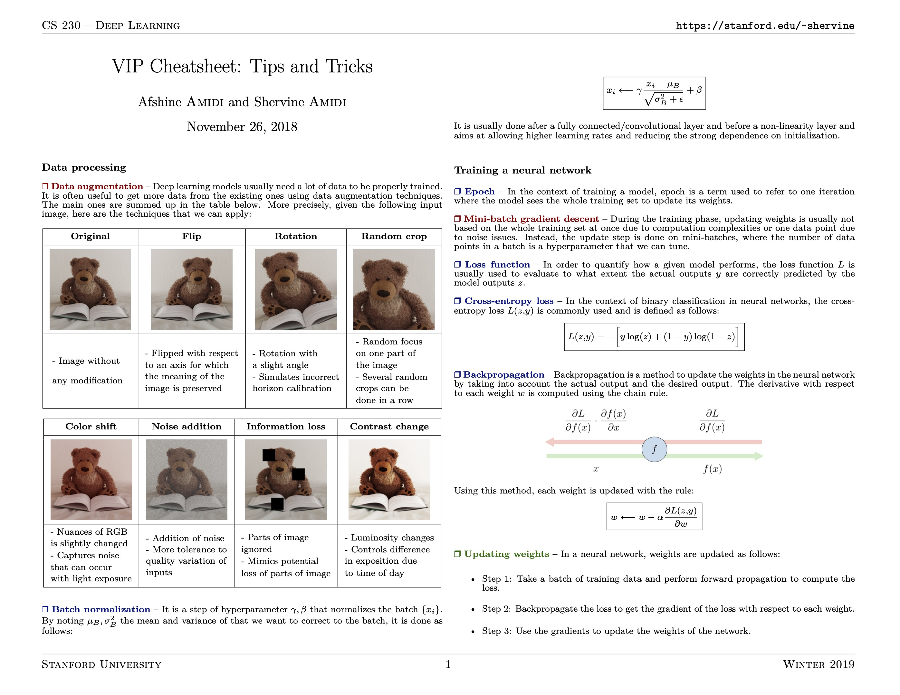

# Awesome Data Science Cheatsheet

Source: https://www.kaggle.com/code/joydeb28/awesome-data-science-cheatsheet/notebook

# Business Science
### Business Science Problem Framework

### Data Science with Python Workflow

# Python
### Python Basics

### Intermediate Python

### Python 3 Memento

### Pandas Basics

### Pandas

### Importing Data

### Jupyter

### Numpy Basics

# Math and Calculus
### Refresher Algebra and Calculus

### Refresher Probabilities and Statistics

# Machine Learning

### Scikit-Learn

### VIP Supervised Learning

### VIP Unsupervised Learning

### VIP Machine Learning Tips and Tricks

# Deep Learning
### Neural Nets Cells

### Neural Nets Graphs

### Keras

### Deep Learning Basics

### Convolutional Neural Networkds

### Recurrent Neural Networks

### Tips and Tricks

# Data Visualization
### Matplotlib

### Seaborn

### Bokeh

### Comprehensive Guide to Data Visualization in Python

# Data Science in General and Others
### Data Science Cheatsheet

### [ML for Beginner - Microsoft](https://github.com/microsoft/ML-For-Beginners)