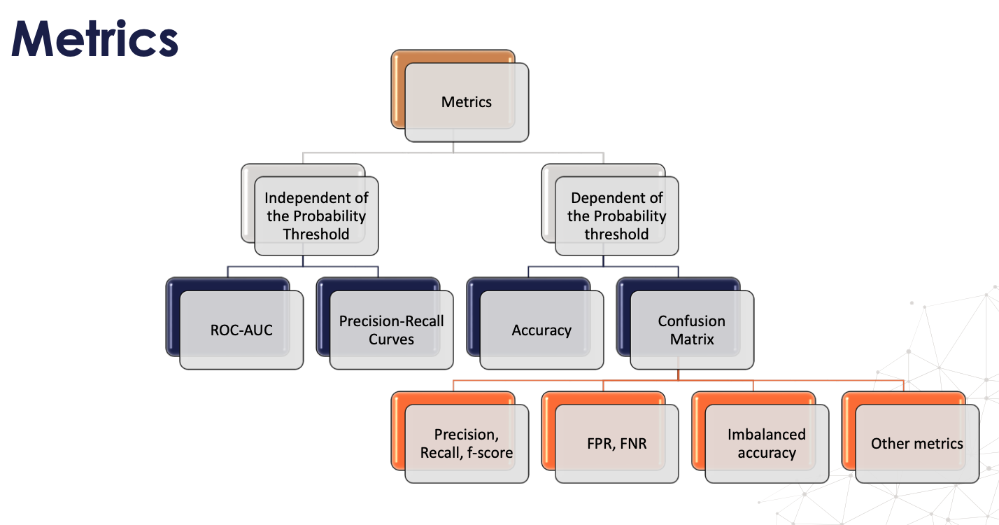

# Evalution Matrix

## 1.  Phép đo đánh giá

- Các phép đo phụ thuộc vào ngưỡng: Độ chính xác/độ chính xác cân bằng/độ chính xác không cân bằng, confusion matrix, F1,...
- Các phép đo độc lập với ngưỡng (nhưng vẫn phụ thuộc vào xác suất): ROC-AUC, đường cong Precision/Recall.

## 2. Các phép đo phụ thuộc vào ngưỡng

### 2.1 Độ chính xác - Accuracy

Độ chính xác (accuracy), là một trong các phép đo chất lượng mô hình được sử dụng phổ biến nhất. Độ chính xác thể hiện phần trăm hoặc **tỷ lệ các dự đoán đúng**, nói cách khác là **tỷ lệ mô hình đưa ra dự đoán đúng**. Công thức xác định độ chính xác được tính bằng **số dự đoán đúng chia cho tổng số dự đoán**.
$$
\text{Accuracy} = \frac{\text{number of correct predictions}}{\text{total number of predictions}}
$$
For binary classification
$$
\text{Accuracy} = \frac{TP + TN}{\text{total number of predictions}}
$$

		- *TP*: True Positive
		- *TN*: True Negative

Độ chính xác không phải phép đo thích hợp với tập dữ liệu mất cân bằng vì nó không phân biệt số lượng mẫu được phân loại chính xác của các lớp khác nhau. Nó không cho chúng ta biết có bao nhiêu dữ liệu lớp thiểu số được dự đoán đúng (đây là lớp mà chúng ta quan tâm tới).

 Ví dụ trong một bộ dữ liệu về dự đoán những người ung thư. Giả sử có 100 cases, trong đó chỉ có 1 case là người thực sự bị ung thư.

Do đó, với tập dữ liệu này thì dù chả tính toán gì, mà tất cả các dự đoán đề return "không bị ung thư", nghiêm nhiên, độ chính xác đã lên tới 99 %. Do đó thước đo về độ chính xác (Accuracy) không thực sự chính xác và phản ánh được chất lượng mô hình có dữ liệu mất cân bằng

### 2.2 Precision, Recall, F-measure

- **True** **Positive rate** (**Recall** or **Sensitivity**): Tỉ lệ đoán Positive đúng trên tổng số Positive thực tế

$$
\text{TP}_{rate} = \frac{TP}{TP + FN} 
$$

- **True** **Negative Rate**: Tỉ lệ đoán Negative đúng trên tổng số Negative thực tế

$$
TN_{rate} = \frac{TN}{TN + FP}
$$

- **Positive Predictive Value** (Precision): Tỉ lệ đoán Positive đúng trong các dự đoán

$$
PP_{value} = \frac{TP}{TP+FP}
$$

- **Negative predictive value:** Tỷ lệ đoán Negative đúng trong các dự đoán
  $$
  NP_{value} = \frac{TN}{TN+FN}
  $$
  