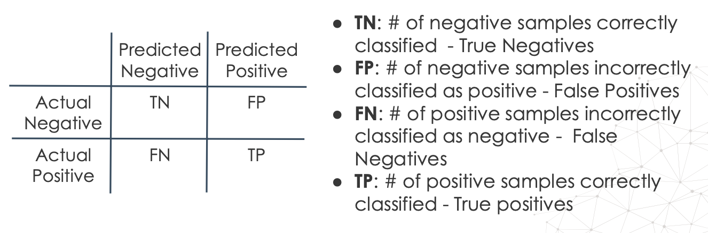
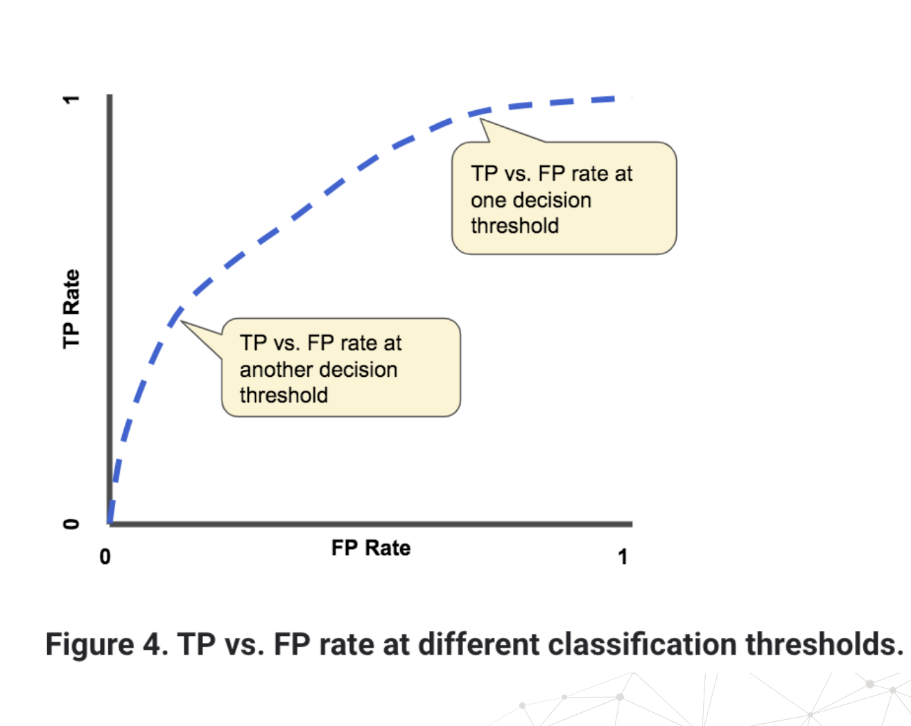
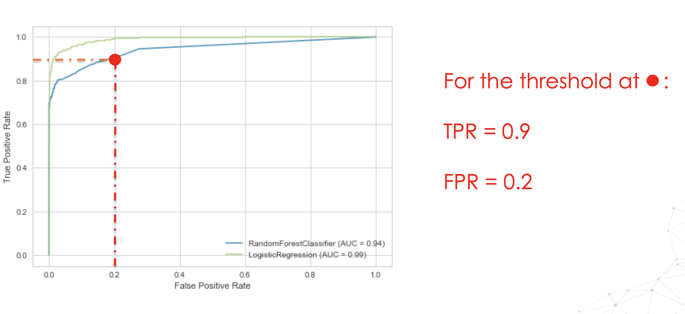
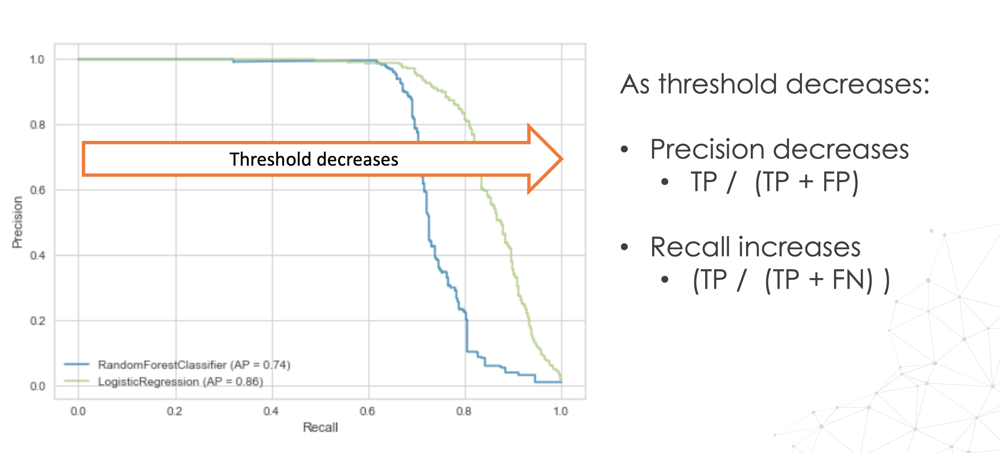

# Evalution Matrix

## 1.  Phép đo đánh giá


- Các phép đo phụ thuộc vào ngưỡng: Độ chính xác/độ chính xác cân bằng/độ chính xác không cân bằng, confusion matrix, F1,...
- Các phép đo độc lập với ngưỡng (nhưng vẫn phụ thuộc vào xác suất): ROC-AUC, đường cong Precision/Recall.


## 2. Các phép đo phụ thuộc vào ngưỡng

### 2.1 Độ chính xác - Accuracy

Độ chính xác (accuracy), là một trong các phép đo chất lượng mô hình được sử dụng phổ biến nhất. Độ chính xác thể hiện phần trăm hoặc **tỷ lệ các dự đoán đúng**, nói cách khác là **tỷ lệ mô hình đưa ra dự đoán đúng**. Công thức xác định độ chính xác được tính bằng **số dự đoán đúng chia cho tổng số dự đoán**.
$$
\text{Accuracy} = \frac{\text{number of correct predictions}}{\text{total number of predictions}}
$$
For binary classification
$$
\text{Accuracy} = \frac{TP + TN}{\text{total number of predictions}}
$$


- **TP** : True Positive

- **TN** : True Negative


Độ chính xác không phải phép đo thích hợp với tập dữ liệu mất cân bằng vì nó không phân biệt số lượng mẫu được phân loại chính xác của các lớp khác nhau. Nó không cho chúng ta biết có bao nhiêu dữ liệu lớp thiểu số được dự đoán đúng (đây là lớp mà chúng ta quan tâm tới).

 Ví dụ trong một bộ dữ liệu về dự đoán những người ung thư. Giả sử có 100 cases, trong đó chỉ có 1 case là người thực sự bị ung thư.

Do đó, với tập dữ liệu này thì dù chả tính toán gì, mà tất cả các dự đoán đề return "không bị ung thư", nghiêm nhiên, độ chính xác đã lên tới 99 %. Do đó thước đo về độ chính xác (Accuracy) không thực sự chính xác và phản ánh được chất lượng mô hình có dữ liệu mất cân bằng


**Code**

```python
from sklearn.metrics import accuracy_score

print('Accuracy Baseline test: ', accuracy_score(y_test, y_test_base))
```


### 2.2 Precision, Recall, F-measure

- **True** **Positive rate** (**Recall** or **Sensitivity**): Tỉ lệ đoán Positive đúng trên tổng số Positive thực tế

$$
\text{TP}_{rate} = \frac{TP}{TP + FN} 
$$

- **True** **Negative Rate**: Tỉ lệ đoán Negative đúng trên tổng số Negative thực tế

$$
TN_{rate} = \frac{TN}{TN + FP}
$$

- **Positive Predictive Value** (Precision): Tỉ lệ đoán Positive đúng trong các dự đoán

$$
PP_{value} = \frac{TP}{TP+FP}
$$

- **Negative predictive value:** Tỷ lệ đoán Negative đúng trong các dự đoán
  $$
  NP_{value} = \frac{TN}{TN+FN}
  $$


:point_right: **Precision** hay **Sensibility** (PPV - positive predictive value) thể hiện có bao nhiêu trường hợp thực sự là positive từ tổng số quan sát được mô hình phát hiện là positive

:point_right: **Recall** cho biết tổng số mẫu positive được mô hình phân loại đúng thành positive, cho nên nếu Recall tăng lên thì xác suất phân loại sai mẫu từ lớp thiểu số sẽ giảm. Mặt khác, Precision cho biết có bao nhiêu mẫu thực sự là positive từ tổng số mẫu được mô hình xác định là positive. Cả precision và recall dao động giữa 0 và 1.

:point_right:  Mục tiêu của chúng ta là tối đa hóa các giá trị đó, tối đa hóa recall sẽ giảm thiểu số lượng phân loại sai của lớp thiểu số, và tối đa hóa precision sẽ giảm số lượng phân loại sai của lớp đa số. Cần ghi nhớ một điều quan trọng là cả precision và recall đều phụ thuộc vào ngưỡng xác suất, là giá trị xác suất trên ngưỡng mà chúng ta cho rằng mẫu này thuộc về lớp thiểu số. Các giá trị precision và recall thay đổi khác nhau tùy thuộc vào ngưỡng mà chúng ta sử dụng để xác định kết quả phân lớp.

Chỉ số F1 là giá trị trung bình điều hòa có trọng số của precision và recall. Chỉ số này được tính bằng hai lần tích của precision và recall chia cho tổng của precision và recall. Việc tối đa hóa F1 đảm bảo rằng chúng ta tạo sự cân bằng tốt nhất giữa precision và recall. F1 dao động giữa 0 và 1, và 1 là giá trị tốt nhất mà chúng ta có thể nhận được.


### 2.3 Bảng nhầm lẫn, FPR. FNR

Các phép đo về sự nhầm lẫn là *trực quan hóa* số lượng các trường hợp được phân loại đúng và sai. 

Ví dụ: chúng ta thấy các quan sát ở đây thực sự negative với các quan sát được dự đoán là negative và những quan sát được dự đoán là positive, hoặc những quan sát thực sự positive với những dự đoán là negative hoặc positive.

- - Nếu kết quả quan sát là positive (tích cực) và nó được dự đoán là positive, thì đó là TP.
  - Nếu kết quả quan sát là negative (tiêu cực) và nó được dự đoán là negative thì đó là TN.
  - Nhưng nếu quan sát là negative mà lại dự đoán là positive thì đó là FP.
  - Còn nếu quan sát là positive mà mô hình lại đoán là negative thì đó là FN.

=> Từ đây, chúng ta sẽ xây dựng được ma trận nhầm lẫn.




**FPR** xác định có bao nhiêu quan sát được xác định là positive hoặc thuộc về lớp thiểu số trong tổng số quan sát thuộc về lớp đa số: 
$$
FPR = \frac{FP}{FP + TN} = 1 - TNR
$$


Nói ngắn gọn, FPR cho biết có bao nhiêu quan sát trong lớp đa số bị phân loại sai.


**FNR** là số lượng quan sát bị phân loại sai trong tổng số quan sát của lớp thiểu số
$$
FNR = \frac{FN}{TP + FN} = 1 - TPR
$$


Ma trận nhầm lẫn, FPR và FNR cũng phụ thuộc vào ngưỡng xác suất để chọn hoặc để phân loại mẫu là positive. Chúng khác nhau tùy thuộc vào ngưỡng. Trong một số trường hợp, chúng ta có thể chọn để giảm thiểu FNR. 

Ví dụ: Khi hiện chẩn đoán, chúng ta muốn giảm thiểu số lượng người bị bệnh mà chúng ta thực sự không chẩn đoán là bị bệnh vì chúng ta cần chỉ định điều trị càng nhanh càng tốt. Do đó, chúng ta không muốn bỏ lỡ bất kỳ trường hợp nào là positive và sẽ có thể chọn tối ưu hóa FNR. Mặt khác, khi nghiên cứu thuốc, trong nhiều loại thuốc, chúng ta cố gắng tìm ra loại thuốc có thể chữa một bệnh nhất định. Chúng ta muốn giảm thiểu FPR, là giảm thiểu số lượng các loại thuốc mà chúng ta nghĩ rằng có ích, nhưng thực tế thì không. Do đó chúng ta không phải chạy thử nghiệm trên nhiều loại thuốc vì điều này rất đắt đỏ và tốn thời gian.


### 2.4 Độ chính xác cân bằng

Độ chính xác cân bằng là giá trị trung bình của Recall từ mỗi lớp, con số này giúp chúng ta hiểu rõ hơn về chất lượng mô hình trên các lớp.


### 2.5 Geometric mean, Dominance, Index of imbalanced accuracy

**Geometric mean** - **Trung bình nhân** là căn bậc hai của tích giữa TPR và TNR, nó cố gắng tối đa hóa độ chính xác ở mỗi lớp. 
$$
G-Mean = \sqrt{\underbrace{\frac{TP}{TP+FN}}_\text{recall} \times \underbrace{\frac{TN}{TN + FP}}_{\text{TNR}}} = \sqrt{\text{sensitivity} \times specificity}
$$
Hãy nhớ rằng TPR thể hiện độ chính xác ở lớp thiểu số trong khi TNR thể hiện độ chính xác ở lớp đa số, trung bình nhân giữ cân bằng các độ chính xác này. Vì vậy, chúng ta có thể sử dụng nó thay cho precision, recall hoặc F-measure để xác định chất lượng của mô hình học máy. Trung bình nhân dao động giữa 0 và 1, 1 là hệ số tốt nhất còn 0 là hệ số kém nhất.

**Dominance (ưu thế**) là hiệu giữa độ chính xác ở lớp thiểu số và lớp đa số, là hiệu giữa TPR và TNR. Giá trị của dominance dao động giữa -1 và 1. 1 cho thấy mô hình có độ chính xác hoàn hảo đối với lớp thiểu số, nhưng nó phân loại sai tất cả các quan sát của lớp đa số. -1 thì ngược lại, mô hình phân loại sai tất cả các quan sát của lớp thiểu số, nhưng phân loại đúng toàn bộ các quan sát của lớp đa số.
$$
Dominance = TPR - TNR = Recall - TNR
$$


Cuối cùng là **Index of imbalanced accuracy -  chỉ số của độ chính xác không cân bằng**, cố gắng chuẩn hóa nhiều phép đo chất lượng sử dụng cho các tập dữ liệu mất cân bằng với hệ số có trọng số.
$$
IBA_{\alpha}(M) = (1 + \alpha . dominance)M
$$
Trong đó $(1 + dominance)$ là *weighting factor* và M thể hiện cho *performance metric*


## 3. Các phép đo độc lập với ngưỡng

### 3.1 ROC-AUC

ROC-AUC là phép đo thường được dùng để đánh giá chất lượng của thuật toán phân loại nhị phân. 

ROC là viết tắt của Receiving Operating Characteristic và đường cong ROC phác thảo đồ thị các lợi ích (**TPR trên trục y)** , với chi phí (**FPR trên trục x**). 

Mỗi điểm trong ROC thể hiện một ngưỡng xác suất mà chúng ta sử dụng làm giới hạn để xác định xem một mẫu có thuộc lớp positive không.



Đường cong ROC đánh giá bộ phân loại phân tách các mẫu positive khỏi các mẫu negative tốt thế nào, và vì nó xem xét các ngưỡng xác suất khác nhau nên nó giúp chúng ta xác định ngưỡng tốt nhất để phân tách chúng.

Diện tích bên dưới đường cong ROC hay AUC (area under curve) cung cấp một phép đo chất lượng mô hình khác trên tất cả các ngưỡng phân loại có thể. AUC càng cao thì mô hình dự đoán cả hai lớp càng tốt. AUC của mô hình hoàn hảo bằng 1. Giá trị càng gần 1 thì chất lượng mô hình càng tốt.



### 3.2 Đường cong Precision-Recall

Đường cong Precision-Recall cho thấy mối quan hệ giữa precision và recall cho mỗi ngưỡng xác suất hoặc ngưỡng xác suất biệt số. Trong biểu đồ, chúng ta sẽ thấy recall trên trục x và precision trên trục y. 

Đường cong Precision-Recall rất mạnh đối với dữ liệu mất cân bằng nên chúng có thể cung cấp chỉ báo tốt hơn hoặc trực quan hơn về chất lượng mô hình và cho phép chúng ta dễ dàng thấy một mô hình tốt hơn mô hình khác như thế nào.

