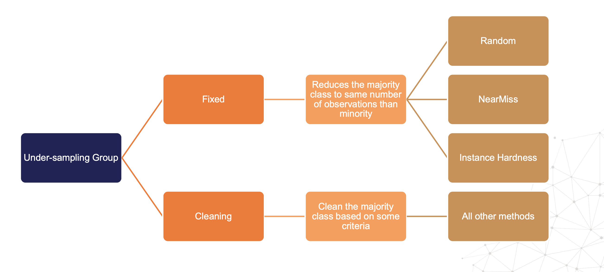
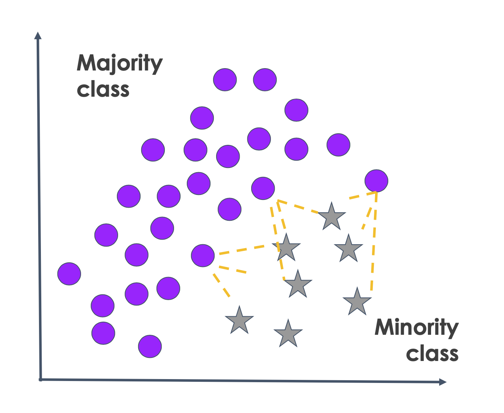
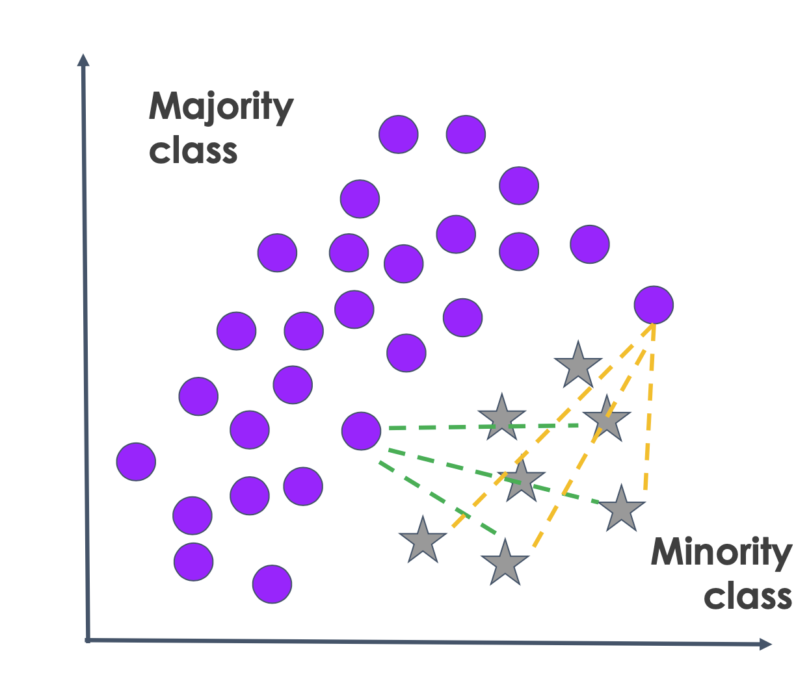
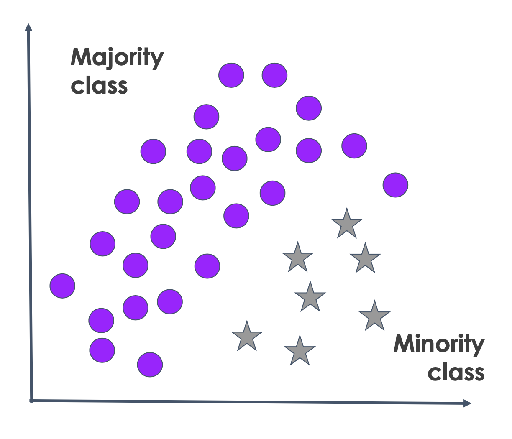
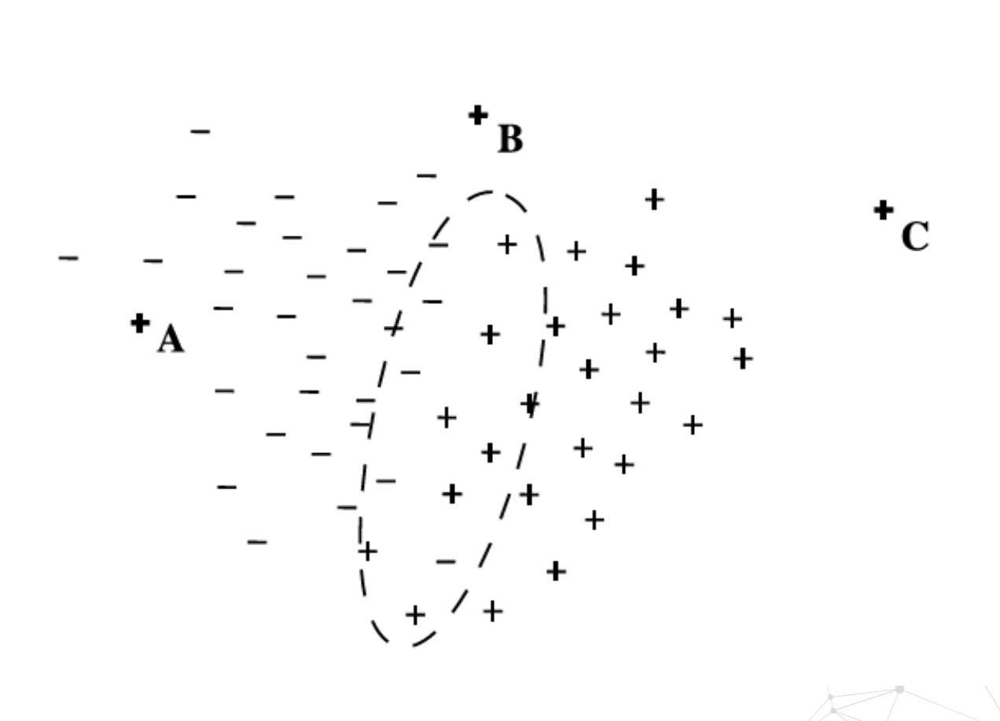

# Under Sampling Method

## 1. Introduction

>  Undersampling là quá trình giảm số lượng quan sát của lớp đa số. Vậy trong trường hợp undersampling điển hình, chúng ta sẽ thu được một tập dữ liệu có ít quan sát cửa lớp đa số hơn.

Vậy giảm bớt thì giảm bớt thế nào, giảm đến đâu, bao giờ thì dừng??

Dưới đây là tổng quan các tiêu chí khác nhau để dừng, hay chọn các observations.




Chúng ta có thể phân ra làm 2 loại **Fixed Under sampling** và **Cleaning Under sampling** 

- Fix Under sampling là phương pháp giảm lớp đa số xuống bằng với số lượng lớp thiểu số. Các thuật toán bao gồm Random, NearMiss, Instance Hardness ...
- Loại bỏ các quan sát khỏi lớp đa số bởi một số các tiêu chí, các tiêu chí này khác nhau với các thuật toán khác nhau


## 2. Fixed undersampling

### 2.1 Random undersampling

>  Random undersampling trích xuất quan các sát ngẫu nhiên của lớp đa số hoặc các lớp đa số cho đến khi đạt được một tỷ lệ cân bằng nhất định. Đây là một kỹ thuật đơn giản, không giả định bất cứ điều gì về dữ liệu mà chỉ chọn các quan sát một cách ngẫu nhiên.

Khi quyết định áp dụng random undersampling, chúng ta cần cân nhắc một số điều. Mặt tốt là chúng ta thu được sự cân bằng tốt của mỗi một lớp. Mặt khác, bằng cách loại bỏ các quan sát khỏi lớp đa số hoặc các lớp đa số, chúng ta có thể đang loại các thông tin quan trọng khiến thuật toán khó tìm hiểu các mẫu để phân biệt các lớp hơn. Vì vậy, chúng ta cần kiểm tra xem random undersampling có cải thiện chất lượng mô hình hay không. Nếu không, chúng ta có thể áp dụng tiêu chí lấy mẫu khác.

```python
rus = RandomUnderSampler(
    sampling_strategy='auto',  # chỉ lấy mẫu lớp đa số
    random_state=0,  # khả năng tái lặp
    replacement=True # có nên lấy lại mẫu với replacement
)  
X_resampled, y_resampled = rus.fit_resample(X, y)
```


### 2.2 NearMiss

Phương pháp NearMiss có 3 phiên bản khác nhau một chút nhưng về cơ bản, nó giữ lại những quan sát gần hơn với lớp thiểu số bằng cách này hay cách khác. NearMiss được thiết kế để làm việc với các tập dữ liệu văn bản, trong đó mỗi từ là một biểu diễn phức tạp của các từ và tag. Với các dữ liệu truyền thống hơn có biến dạng số và hạng mục, chúng ta cũng nên thử nghiệm.

 **Version 1**



Phương pháp này xác định **khoảng cách trung bình** giữa **mỗi quan sát** của lớp đa số với các **quan sát gần nhất** của lớp thiểu số.

Sau đó nó sẽ giữ lại những quan sát đó của lớp đa số có khoảng cách trung bình đến K neighbour của lớp thiểu số là nhỏ nhất.

```python
nm1 = NearMiss(
    sampling_strategy='auto',  # chỉ undersample lớp đa số
    version=1,
    n_neighbors=3,
    n_jobs=4)  # có 4 core trong máy

X_resampled, y_resampled = nm1.fit_resample(X, y)
```


**Version 2**





Với version này, nó sẽ xác định khoảng cách từ mỗi mẫu của lớp đa số đến neighbour xa nhất của lớp thiểu số. Sau khi tính toán mọi quan sát của lớp đa số, nó sẽ giữ lại quan sát có khoảng cách nhỏ nhất

```python
nm2 = NearMiss(
    sampling_strategy='auto',  # chỉ undersample lớp đa số
    version=2,
    n_neighbors=3,
    n_jobs=4)  # có 4 core trong máy

X_resampled, y_resampled = nm2.fit_resample(X, y)
```


**Version 3**


Đây là một quy trình hai bước



**Bước 1:** Nhìn từ phía lớp thiểu số, là K quan sát gần nhất từ lớp đa số. Bước này trả về một tập dữ liệu trung gian đã loại bỏ tất cả các quan sát cách xa lớp thiểu số


**Bước 2:** Nhìn từ phía lớp đa số, nó sẽ tìm khoảng cách tới neighbour xa nhất của lớp đối diện, sau đó nó sẽ giữ lại các khoảng cách trung bình xa nhất.

Theo một nghĩa nào đó, bước đầu tiên loại bỏ những quan sát xa lớp thiểu số nhất. Và ở bước 2 nó giữ lại nhóm con đã chọn, những nhóm đang ở xa. Không phải là những nhóm gần nhất mà là những nhóm xa một chút

```python
nm3 = NearMiss(
    sampling_strategy='auto',  # chỉ undersample lớp đa số
    version=3,
    n_neighbors=3,
    n_jobs=4)  # có 4 core trong máy

X_resampled, y_resampled = nm3.fit_resample(X, y)
```


### 2.3 Ngưỡng Instance Hardness

Instance Hardness là phép đo độ khó để phân loại trường hợp hoặc quan sát một cách chính xác. 

Instance hardness hay xác suất phân loại sai một quan sát thuộc vào hai điều. 

	- Đầu tiên là thuật toán mà chúng ta sử dụng để mô hình hóa nhiệm vụ 
	- Thứ hai là mối quan hệ quan sát với các quan sát khác trong tập dữ liệu, hay với chồng chéo lớp. 


Chúng ta có thể hiểu trực quan là một quan sát càng gần một quan sát của lớp đối diện thì thuật toán sẽ càng khó phân loại chúng một cách chính xác. 



Về cơ bản, các trường hợp hoặc quan sát khó phân loại chính xác *là những trường hợp mà thuật toán học tập có xác suất dự đoán nhãn lớp đúng thấp.* Trong hình minh hoạ này thì, các trường hợp bên trong hình oval là các border point giữa hai lớp. Vì vậy, với một quan sát của lớp thiểu số, xác suất thuật toán trả về càng thấp thì khả năng chúng bị phân loại sai càng cao, vậy đây là những trường hợp khó phân loại.

Phép đo instance hardness bằng một trừ đi xác suất và nó thể hiện xác suất của một quan sát bị phân loại sai. Vì vậy, khi xác suất lớp thấp thì instance hardness cao. Ngưỡng instance hardness là một ý tưởng rất đơn giản: **loại bỏ các hard instance khỏi dữ liệu để giảm chồng chéo lớp và tăng khả năng phân tách lớp với các trường hợp có instance hardness lớn hơn một ngưỡng nhất định.** 

Vậy vấn đề ở đây là làm thế nào để tìm ra ngưỡng này? Các tác giả của phương pháp này đã thử một số ngưỡng bất kỳ và họ kết luận rằng các ngưỡng khác nhau hoạt động tốt hơn với các tập dữ liệu khác nhau. Ưu điểm của kỹ thuật này là chúng ta có thể thay đổi ngưỡng để loại bỏ ít hoặc nhiều quan sát hơn.