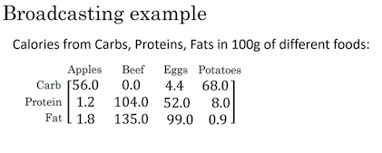

# Numpy and Vectorization

## Vectorization

> - Đây là phương pháp nhằm loại bỏ các `for` loop trong code. Giúp chương trình chạy nhanh hơn.
> - Hàm `dot` thư viện NumPy sử dụng vectơ hóa mặc định. Vectơ hóa có thể thực hiện trong CPU hoặc GPU qua phép toán SIMD, nhưng nhanh hơn trong GPU.
> - Hãy tránh vòng lặp for khi có thể, và phần lớn các phương thức thư viện NumPy là phiên bản vectơ hóa.

Ví dụ: Tính **Logistic regression derivatives**


Từ công thức để tính đạo hàm:

$d(a) = \frac{d \mathcal{L}}{da} = \frac{d }{da}(-(y\log(a) + (1-y)\log(1-a))) = -\frac{y}{a} + \frac{1-y}{1-a}$

$d(z) = \frac{d \mathcal{L}}{dz} = a -y$

$d(w_1) = x_1 * d(z)$

$d(w_2) = x_2 * d(z)$

$d(b) = d(z)$

- <mark><strong>Non-Vectorization</strong></mark>

```python
# Đạo hàm
J = 0; dw1 = 0; dw2 = 0; db = 0;
for i = 1 to m
    # Forward
    z(i) = w1*x1(i) + w2*x2(i) + b
    a(i) = Sigmoid(z(i))
    J += -(y(i)*log(a(i)) + (1-y(i))*log(1-a(i)))

    # Backward pass
    dz(i) = a(i) - y(i)
    dw1 += dz(i) * x1(i)
    dw2 += dz(i) * x2(i)
    db += dz(i)

J = J/m
dw1 = dw1/m
dw2 = dw2/m
db = db/m
```

- <mark><strong>Vectorization</strong></mark>

Chúng ta  có đầu vào là ma trận 

- $\textbf{X} \in \mathrm{R}^{n\times m}$
- $ \textbf{y} \in \mathrm{R}^{m\times 1}$ 
- $\textbf{z} = \textbf{w}^{T}\times \textbf{X} + \textbf{b}$
- $w = \begin{bmatrix} w^{(1)} \\ w^{(2)} \\ \vdots  \\ w^{(n)} \end{bmatrix} \in \mathbf{R}^{n \times 1}$

$$
\left[ z^{(1)}, z^{(2)} \cdots , z^{(m)} \right] = w^{T} 
\begin{bmatrix}
\vdots  & \vdots  & \vdots & \vdots\\
 x^{(1)} & x^{(2)} & \cdots   & x^{(m)} \\
 \vdots & \vdots & \vdots & \vdots
\end{bmatrix} 

+ \left[ b, b, \cdots , b \right]
$$

$m$ training example : $\{(x^{(1)}, y^{(1)}), (x^{(2)}, y^{(2)}), ..., (x^{(m)}, y^{(m)})\}$

$n$ features

```python
z = np.dot(w.T, x) + b # Z shape is (1, m)
a = 1/(1 + np.exp(-z)) # A shape is (1,m)

dz = a - z						# dz shape is (1,m)
dw = np.dot(x, dz.T)/m	# dw shape is (Nx, 1)
db = np.sum(dz)/m

# Gradient decent
w := w - alpha * dw
b := b - alpha * db


```

## Broadcasting in Python



Cần tính tỷ lệ % Calo từ Carb, Protein, Fat.

Ví dụ với cột đầu tiên

- Cần phải tính tổng lượng calos từ 100g Apples (tổng cột 1 = 59 cal)
- Cần tính tỉ lệ, ví dụ với Carb thì % = $\frac{56.0}{59} = 94.9$

Giả sử ma trận trên tương ứng là $\mathbf{A} \in \mathbf{R}^{(3\times4)}$

```python
cal = A.sum(axis=0)				# Tổng theo cột, muốn tổng theo hàng thì thay axis = 1
percentage = 100 * A / cal.reshape(1,4) 
# Có thể không cần gọi reshape(1,4), vì bản thân ma trận cal đã có kích thước 1x4 rồi
# Việc gọi reshape chỉ là để đảm bảo.
```

## A note on Python/Numpy vector

Hàm sigmoid
$$
\text{For } x \in \mathbb{R}^n \text{,     } sigmoid(x) = sigmoid\begin{pmatrix}
    x_1  \\
    x_2  \\
    ...  \\
    x_n  \\
\end{pmatrix} = \begin{pmatrix}
    \frac{1}{1+e^{-x_1}}  \\
    \frac{1}{1+e^{-x_2}}  \\
    ...  \\
    \frac{1}{1+e^{-x_n}}  \\
\end{pmatrix}\tag{1}
$$

```python
import numpy as np 

def sigmoid(x):
    """
    Tính sigmoid của x
    
    Đối số:
    x -- Mảng numpy hoặc vô hướng có bất kỳ kích thước nào 

    Trả về:
    s -- sigmoid(x)
    """    
    s = 1 / (1 + np.exp(-x))
    return s
```

Sigmoid gradient
$$
sigmoid\_derivative(x) = \sigma'(x) = \sigma(x) (1 - \sigma(x))\tag{2}
$$

```python
def sigmoid_derivative(x):
    """
    Tính gradient (cũng gọi là slope hoặc đạo hàm) của hàm sigmoid với đầu vào x của nó.
    Lưu đầu ra của hàm sigmoid vào các biến rồi sử dụng nó để tính gradient
    
    Đối số:
    x -- Mảng vô hướng hoặc mảng numpy

    Trả về:
    ds -- Gradient đã tính.
    """
    
    s = 1 / (1 + np.exp(-x))
    ds = s * (1 - s)
    
    return ds
```

```python
x = np.array([1, 2, 3])
print ("sigmoid_derivative(x) = " + str(sigmoid_derivative(x)))
```

```shell
sigmoid_derivative(x) = [0.19661193 0.10499359 0.04517666]
```

Reshape image từ $(num\_px, num\_px, 3)$ thành $(num\_px * num\_px * 3, 1)$

```python
X_flatten = X.reshape(X.shape[0], -1).T      # X.T là chuyển vị của X
```

**Những thứ cần nhớ**

>Các bước phổ biến để xử lý trước một tập dữ liệu mới là:
>
>- Tìm ra các kích thước và hình dạng của bài toán (m_train, m_test, num_px, ...)
>- Định hình lại các tập dữ liệu để mỗi ví dụ bây giờ là một vectơ có kích thước (num_px \* num_px \* 3, 1)
>- "Chuẩn hóa" dữ liệu

**Logistic Regression example **

Helper functions

```python
def sigmoid(z):
    """
    Tính sigmoid của z

    Đối số:
    z -- Mảng numpy hoặc vô hướng có kích thước bất kỳ.

    Trả về:
    s -- sigmoid(z)
    """
    s = 1/(1+np.exp(-z))
    return s
```

Khởi tạo tham số

```python
def initialize_with_zeros(dim):
    """
    Hàm này tạo một vectơ của 0 có shape (dim, 1) cho w và khởi tạo b bằng 0.
    
    Đối số:
    dim -- kích thước của vectơ w mà chúng ta muốn (hoặc trong trường hợp này là số tham số)
    
    Trả về:
    w -- vectơ đã khởi tạo có shape (dim, 1)
    b -- số vô hướng đã khởi tạo (tương ứng với độ chệch)
    """
    w, b = np.zeros((dim, 1)) , 0
    assert(w.shape == (dim, 1))
    assert(isinstance(b, float) or isinstance(b, int))
    
    return w, b
```

Truyền xuôi (Forward propagation) và Truyền ngược (Backward propagation)

Truyền xuôi:

- Bạn có X

- Tính $A = \sigma(w^T X + b) = (a^{(0)}, a^{(1)}, ..., a^{(m-1)}, a^{(m)})$

- Tính hàm chi phí: $J = -\frac{1}{m}\sum_{i=1}^{m}y^{(i)}\log(a^{(i)})+(1-y^{(i)})\log(1-a^{(i)})$

Truyền ngược:

- $$ \frac{\partial J}{\partial w} = \frac{1}{m}X(A-Y)^T\tag{7}$$

- $$ \frac{\partial J}{\partial b} = \frac{1}{m} \sum_{i=1}^m (a^{(i)}-y^{(i)})\tag{8}$$

```python
def propagate(w, b, X, Y):
    """
    Triển khai hàm chi phí và gradient cho lan truyền đã giải thích ở trên

    Đối số:
    w -- trọng số, một mảng numpy có kích thước (num_px * num_px * 3, 1)
    b -- độ chệch, một số vô hướng
    X -- dữ liệu có kích thước (num_px * num_px * 3, số ví dụ)
    Y -- vectơ true "label" (chưa 0 nếu là non-cat, 1 nếu là cat) có kích thước (1, số ví dụ)

    Trả về:
    cost -- chi phí negative log-likelihood cho hồi quy logistic
    dw -- gradient của loss với w, do đó shape tương tự như w
    db -- gradient của loss với b, do đó shape tương tự như b
    """
    ## TRUYỀN XUÔI
    m = X.shape[1]
    z = np.dot(w.T, X) + b
    
    a = sigmoid(z)                                   
    cost = -1/m * np.sum(Y*np.log(a) + (1-Y)*np.log(1-a))
    
    # TRUYỀN NGƯỢC (TÌM GRAD)
    dz = a - Y
    dw = 1/m * np.dot(X, dz.T)
    db = 1/m * np.sum(dz)    

    assert(dw.shape == w.shape)
    assert(db.dtype == float)
    cost = np.squeeze(cost)
    assert(cost.shape == ())
    
    grads = {"dw": dw,
             "db": db}
    
    return grads, cost
```

Tối ưu hoá: $ \theta = \theta - \alpha \text{ } d\theta$, trong đó $\alpha$ là tốc độ học.

```python
def optimize(w, b, X, Y, num_iterations, learning_rate, print_cost = False):
    """
    Hàm này tối ưu hóa w và b bằng cách chạy thuật toán gradient descent
    
    Đối số:
    w -- trọng số, một mảng numpy có kích thước (num_px * num_px * 3, 1)
    b -- độ chệch, một số vô hướng
    X -- dữ liệu có shape (num_px * num_px * 3, số ví dụ)
    Y -- vectơ true "label" (0 nếu là non-cat, 1 nếu là cat), có shape (1, số ví dụ)
    num_iterations -- số lần lặp của vòng lặp tối ưu
    learning_rate -- tốc độ học của quy tắc cập nhật gradient descent
    print_cost -- nếu là True thì in ra loss sau mỗi 100 bước
    
    Trả về:
    params -- dictionary chứa trọng số w và độ chệch b
    grads -- dictionary chứa gradient của trọng số và độ chệch liên quan tới hàm chi phí 
    costs -- danh sách tất cả các chi phí đã tính toán trong quá trình tối ưu hóa, chúng ta sẽ sử dụng điều này sẽ vẽ đồ thị học.
    """
    
    costs = []
    
    for i in range(num_iterations):
        
        
        # Tính chi phí và gradient (≈ 1-4 dòng code)
        ### BẮT ĐẦU CODE Ở ĐÂY ### 
        grads, cost = propagate(w, b, X, Y)
        ### KẾT THÚC CODE Ở ĐÂY ###
        
        # Truy xuất đạo hàm từ grads
        dw = grads["dw"]
        db = grads["db"]
        
        # quy tắc cập nhật (≈ 2 dòng code)
        ### BẮT ĐẦU CODE Ở ĐÂY ###
        w = w - learning_rate * dw
        b = b - learning_rate * db
        
        ### KẾT THÚC CODE Ở ĐÂY ###
        
        # Ghi các chi phí
        if i % 100 == 0:
            costs.append(cost)
        
        # In ra chí phí sau mỗi 100 ví dụ huấn luyện
        if print_cost and i % 100 == 0:
            print ("Cost after iteration %i: %f" %(i, cost))
    
    params = {"w": w,
              "b": b}
    
    grads = {"dw": dw,
             "db": db}
    
    return params, grads, costs
```

Prediction

```python
def predict(w, b, X):
    '''
    Dự đoán xem nhãn là 0 hay 1 sử dụng các tham số hồi quy logistic đã tìm hiểu (w, b)
    
    Đối số:
    w -- trọng số, mảng numpy có kích thước (num_px * num_px * 3, 1)
    b -- độ chệch, số vô hướng
    X -- dữ liệu có kích thước (num_px * num_px * 3, số ví dụ)
    
    Trả về:
    Y_prediction -- mảng numpy (vectơ) chứa toàn bộ dự đoán (0/1) cho các ví dụ trong X
    '''
    
    m = X.shape[1]
    Y_prediction = np.zeros((1,m))
    w = w.reshape(X.shape[0], 1)
    
    # Tính vectơ "A" dự đoán xác suất để mèo có mặt trong hình
    A = sigmoid(np.dot(w.T, X) + b)
    
    for i in range(A.shape[1]):
        # Chuyển xác suất A[0,i] thành dự đoán thực p[0,i]
        Y_prediction[0, i] = 1 if A[0, i] > 0.5 else 0
    
    assert(Y_prediction.shape == (1, m))
    
    return Y_prediction
```

