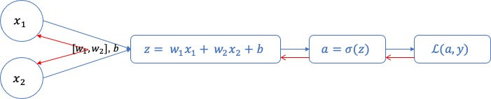
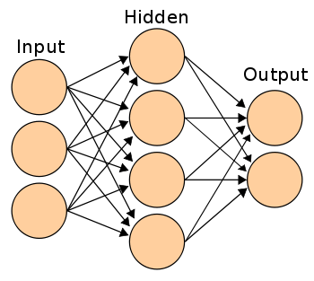
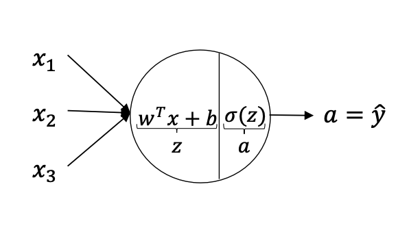
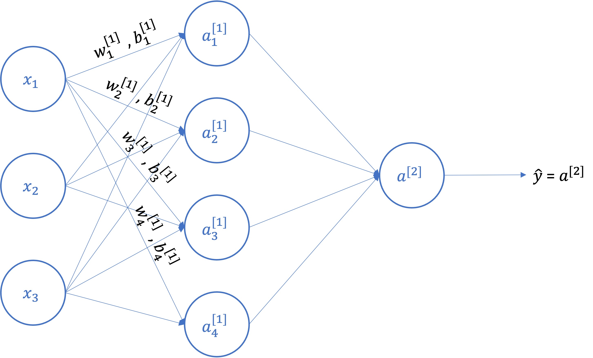
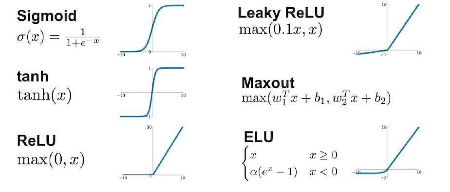
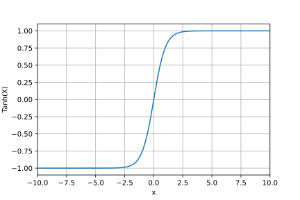
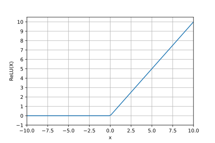
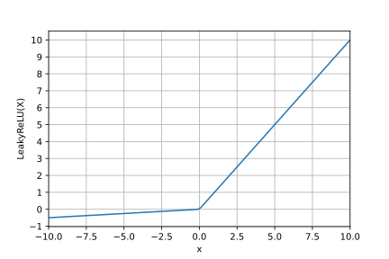
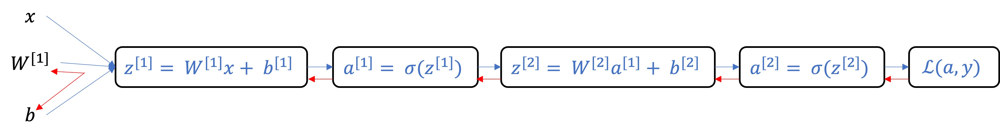

# Shallow Neural Network

### Recap **Logistic Regression** 



- Chiều xuôi:  **Loss functions**

  - $z = w^{T}x + b$


  - $\hat{y} = a = \sigma(z)$


  - $\mathscr{L}(a, y) = -(y\log(a) + (1-y)\log(1-a))$

- Chiều ngược: **Gradient**
  - $d(a) = \frac{d \mathcal{L}}{da} = \frac{d }{da}(-(y\log(a) + (1-y)\log(1-a))) = -\frac{y}{a} + \frac{1-y}{1-a}$
  - $d(z) = \frac{d \mathcal{L}}{dz} = a -y$
  - $d(w_1) = x_1 * d(z)$
  - $d(w_2) = x_2 * d(z)$


### **Khái niệm**

> Neural network  (Artificial neural network - ANN hay neural network) là một **mô hình toán học** hay **mô hình tính toán** được xây dựng dựa trên các mạng neural sinh học. 
>
> Nó gồm có một nhóm các **node neural** nối với nhau, và xử lý thông tin bằng cách truyền theo các kết nối và tính giá trị mới tại các node (cách tiếp cận connectionism đối với tính toán). Trong nhiều trường hợp, Neural network là một **hệ thống thích ứng (adaptive system)** tự thay đổi cấu trúc của mình dựa trên các thông tin bên ngoài hay bên trong chảy qua mạng trong quá trình học.
>
> Trong thực tế sử dụng, nhiều mạng neural là các công cụ mô hình hóa dữ liệu thống kê **phi tuyến**. Chúng có thể được dùng để mô hình hóa các mối quan hệ phức tạp giữa dữ liệu vào và kết quả hoặc để tìm kiếm các dạng/mẫu trong dữ liệu.



Nguồn: [Wiki](https://vi.wikipedia.org/wiki/M%E1%BA%A1ng_th%E1%BA%A7n_kinh_nh%C3%A2n_t%E1%BA%A1o)


### Neuron

Neuron là đơn vị nguyên tử của neural network. Cho một đầu vào, nó sẽ cung cấp đầu ra, chuyển đổi cho lớp tiếp theo.

Một neuron có thể được coi là sự kết hợp của 2 thành phần.



- Phần 1: Tính toán $z$ dựa trên các đầu vào và trọng số
- Phần 2: Hàm kích hoạt (chi tiết ở phần sau)


### Hidden layer

Hidden layer là các lớp neuron nằm giữa input layer và output layer.

Shallow network thì thường chỉ có từ 1 đến 2 hidden layer

**Notation**

- Chỉ số trên $[i]$ biểu thị lớp ẩn số mấy, ví dụ: $z^{[1]}$ thuộc lớp ẩn thứ nhất

- $\textbf X$ là vector đầu vào

- $\textbf W^{[i]}_{j}$ là **weight** liên quan đến neuron $j$ thuộc lớp thứ $i$

- $\textbf b^{[i]}_{j}$ là **bias** liên quan đến neuron $j$ thuộc lớp thứ $i$

  

### Neural network




**Forward propagation**

Cho input **x**: 

- $z^{[1]} = \textbf W^{[1]}x + \textbf b^{[1]}$
- $a^{[1]} = \sigma(z^{[1]})$
- $z^{[2]} = \textbf W^{[2]}a^{[1]} + \textbf b^{[2]}$
- $a^{[2]} = \sigma(z^{[2]})$


**Vectorizing across multiple examples**

Ta có: 

$\textbf{X} = \begin{bmatrix}
\vdots  & \vdots  & \vdots & \vdots\\
 x^{(1)} & x^{(2)} & \cdots   & x^{(m)} \\
 \vdots & \vdots & \vdots & \vdots
\end{bmatrix}$

$\textbf{A}^{[1]} = \begin{bmatrix}
\vdots  & \vdots  & \vdots & \vdots\\
 a^{[1](1)} & a^{[1](2)} & \cdots   & a^{[1](m)} \\
 \vdots & \vdots & \vdots & \vdots
\end{bmatrix}$


$Z^{[1]} = W^{[1]}X + b^{[1]}$

$A^{[1]} = \sigma(Z^{[1]})$

$Z^{[2]} = W^{[2]}A^{[1]} + b^{[2]}$

$A^{[2]} = \sigma(Z^{[2]})$


`for i = 1 to m:`

​		$z^{[1](i)} = W^{[1]}x^{i} + b^{[1]}$

​		$a^{[1](i)} = \sigma(z^{[1](i)})$

​		$z^{[2](i)} = W^{[2]}a^{[1](i)} + b^{[2]}$

​		$a^{[2](i)} = \sigma(z^{[2](i)})$


### Activation Functions

Nguồn: https://aicurious.io/posts/2019-09-23-cac-ham-kich-hoat-activation-function-trong-neural-networks/




<center>Các gàm kích hoạt (Activation Functions)</center>


> Hàm kích hoạt (activation function) mô phỏng tỷ lệ truyền xung qua [axon](https://vi.wikipedia.org/wiki/S%E1%BB%A3i_tr%E1%BB%A5c) của một neuron thần kinh. Trong một mạng nơ-ron nhân tạo, hàm kích hoạt đóng vai trò là thành phần phi tuyến tại output của các nơ-ron.

#### **Tại sao lại cần các hàm kích hoạt phi tuyến?**

Nếu không có các hàm kích hoạt phi tuyến, thì mạng nơ-ron của chúng ta dù có nhiều lớp vẫn sẽ có hiệu quả như một lớp tuyến tính mà thôi. Vì thế, việc xếp chồng các lớp nơ-ron lên nhau là vô nghĩa.

#### **Sigmoid**

$$
\sigma(x) = \frac{ 1 }{ 1 + e^{-x} }
$$


Hàm Sigmoid nhận đầu vào là một số thực và chuyển thành một giá trị trong khoảng (0;1). Đầu vào là số thực âm rất nhỏ sẽ cho đầu ra tiệm cận với 0, ngược lại, nếu đầu vào là một số thực dương lớn sẽ cho đầu ra là một số tiệm cận với 1.

Trong quá khứ hàm Sigmoid hay được dùng vì có đạo hàm rất đẹp. Tuy nhiên hiện nay hàm Sigmoid rất ít được dùng

**Nhược điểm:**

- **Hàm Sigmoid bão hào và triệt tiêu gradient:** Một nhược điểm dễ nhận thấy là khi đầu vào có trị tuyệt đối lớn (rất âm hoặc rất dương), gradient của hàm số này sẽ rất gần với 0. Điều này đồng nghĩa với việc các hệ số tương ứng với unit đang xét sẽ gần như không được cập nhật (còn được gọi là *vanishing gradient*).
- **Hàm Sigmoid không có trung tâm là 0 gây khó khăn cho việc hội tụ.**

Rất may chúng ta có thể giải quyết vấn đề này bằng cách chuẩn hoá dữ liệu về dạng có trung tâm là 0 (zero-centered) với các thuật toán batch/layer normalization.

**Code**:

```python
import math
import numpy as np

def sigmoid(x):
  return 1/(1+ np.exp(-x))
```

#### **Tanh**

$$
\tanh(x) = \frac{e^x – e^{-x}}{e^x + e^{-x}}
$$




Hàm **tanh** nhận đầu vào là một số thực và chuyển thành một giá trị trong khoảng (-1; 1). 

Cũng như **Sigmoid**, hàm **Tanh** bị bão hoà ở 2 đầu (gradient thay đổi rất ít ở 2 đầu). Tuy nhiên hàm **Tanh** lại đối xứng qua 0 nên khắc phục được một nhược điểm của **Sigmoid**.

Hàm **tanh** còn có thể được biểu diễn bằng hàm sigmoid như sau:
$$
\tanh(x) = 2 \sigma(2x) -1
$$
**Code**

```python
import numpy as np

z = np.array([1,2,3,4])
a = np.tanh(z)
```


#### **ReLU**

$$
f(x) = max(0, x)
$$



Hàm **ReLU** đang được sử dụng khá nhiều trong những năm gần đây khi huấn luyện các mạng neuron. **ReLU** đơn giản lọc các giá trị < 0. Nhìn vào công thức chúng ta dễ dàng hiểu được cách hoạt động của nó. Một số ưu điểm khá vượt trội của nó so với **Sigmoid** và **Tanh**:

**Ưu điểm**

- Tốc độ hội tụ nhanh hơn hẳn. **ReLU** có tốc độ hội tụ nhanh gấp 6 lần **Tanh** ([Krizhevsky et al.](http://www.cs.toronto.edu/~fritz/absps/imagenet.pdf)). Điều này có thể do **ReLU** không bị bão hoà ở 2 đầu như **Sigmoid** và **Tanh**.
- Tính toán nhanh hơn. **Tanh** và **Sigmoid** sử dụng hàm `exp` và công thức phức tạp hơn **ReLU** rất nhiều do vậy sẽ tốn nhiều chi phí hơn để tính toán.


**Nhược điểm**

- Với các node có giá trị nhỏ hơn 0, qua **ReLU** activation sẽ thành 0, hiện tượng đấy gọi là "*Dying ReLU*". Nếu các node bị chuyển thành 0 thì sẽ không có ý nghĩa với bước linear activation ở lớp tiếp theo và các hệ số tương ứng từ node đấy cũng không được cập nhật với gradient descent. => **Leaky ReLU** ra đời.
- Khi learning rate lớn, các trọng số (weights) có thể thay đổi theo cách làm tất cả neuron dừng việc cập nhật.


**Code: **

```python
a = np.maximum(z, 0)
```


#### Leaky ReLU

$$
f(x) = \mathbb{1}(x < 0) (\alpha x) + \mathbb{1}(x>=0) (x)
$$

với $\alpha$ là hằng số nhỏ.



**Leaky ReLU** là một cố gắng trong việc loại bỏ "*dying ReLU*". Thay vì trả về giá trị 0 với các đầu vào <0 thì **Leaky ReLU** tạo ra một đường xiên có độ dốc nhỏ. Có nhiều báo cáo về việc hiệu **Leaky ReLU** có hiệu quả tốt hơn **ReLU**, nhưng hiệu quả này vẫn chưa rõ ràng và nhất quán.

Ngoài **Leaky ReLU** có một biến thể cũng khá nổi tiếng của **ReLU** là **PReLU**. **PReLU** tương tự **Leaky ReLU** nhưng cho phép neuron tự động chọn hệ số $\alpha$ tốt nhất.

**Code**

```python
import numpy as np

x = np.array([[-0.48017645, -0.44408717],
       [-0.1838917 , -0.24481959],
       [ 0.33408084,  0.42567599]])

alpha = 0.01
z = np.where(x > 0, x, x * alpha)

```


#### Lựa chọn Activation function

- Với **Sigmoid** thì hầu như sẽ không bao giờ được sử dụng ngoại trừ các bài toán phân loại nhị phân. Hoặc kể cả với các bài toán phân loại nhị phân thì cũng chỉ dùng hàm **Sigmoid** cho layer output, còn các hiden layer thì có thể sử dụng **tanh** sẽ tối ưu hơn nhiều vì trung điểm hội tụ là 0
- Hàm kích hoạt được sử dụng nhiều nhất là ReLU. Nếu bạn không chắc chắn nên sử dụng hàm gì thì hãy sử dụng ReLU
- Có thể thử Leaky ReLU với $\alpha = 0.01$ 

Sẽ rất khó để chọn lựa hay hướng dẫn chi tiết cách chọn lựa, Andrew Ng nghĩ rằng, bạn nên thử nghiệm các lựa chọn khác nhau và đánh giá chúng.


### Back propagation



- Lan truyền xuôi dùng để tính giá trị dự đoán, suy ra mất mát dựa vào Loss function: $\mathscr{L}(a, y) = -(y\log(a) + (1-y)\log(1-a))$
- Lan truyền ngược dùng để tính đạo hàm từng phần của Loss Function cho các trọng số ở mỗi Layer


