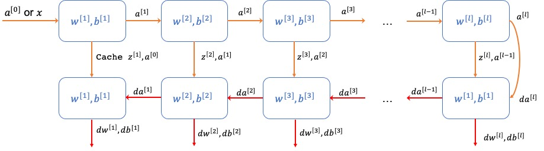

# Deep neural network 

### Notations

- $L = 4$ : #number of layers
- $n^{[l]}$: # number of units in layer $l$
- $a^{[l]}$ : activation in layer $l$
- $a^{[l]} = g^{[l]}(z^{[l]})$: activation function lin layer $l$
- $W^{[l]} = $ weights for $z^{[l]}$
- $b^{[l]} = $ bias for $z^{[l]}$
- $x = a^{[0]}$
- $\hat{y} = a^{[L]}$

### Shapes

- shape of $W$ : $(n^{[l]}, n^{[l-1]})$
- shape of $b$ : $(n^{[l]}, 1)$
- shape of $dw$ = shape of $W$
- shape of $db$ = shape of $b$
- shape of $Z^{[l]}, A^{[l]}, dZ^{[l]}, dA^{[l]}: $ $(n^{[l]}, m)$

### Tại sao cần deep learning

Mạng nơron sâu tạo liên hệ với dữ liệu từ đơn giản tới phức tạp. Ở từng lớp, nó cố tạo quan hệ với lớp trước đó, ví dụ:

- Ứng dụng nhận diện khuôn mặt (Face recognition): Hình ảnh => Các cạnh => Các bộ phận trên khuôn mặt => Các khuôn mặt => Khuôn mặt mong muốn.
- Ứng dụng nhận diện âm thanh (Audio recognition): Âm thanh => Các đặc trưng âm thanh ở mức độ thấp (sss,bb) => Phonemes $m$ vị => Từ => Câu.

Các nhà nghiên cứu nơron cho rằng mạng nơron sâu “tư duy” như não bộ (đơn giản ⇒ phức tạp). 

Khi bắt đầu ứng dụng, chúng ta chưa cần bắt đầu trực tiếp bằng nhiều lớp ẩn. Hãy thử giải pháp đơn giản nhất (chẳng hạn: Hồi quy logistic) rồi thử mạng nơron nông,...

### Xây dựng các blocks cho Deep Neural Network

$$
\large \color{purple} x = a^{[0]} \longrightarrow  \color{Red} z^{[1]} = w^{[1]}a^{[0]} + b^{[1]} \longrightarrow a^{[1]} = g^{[1]}(z^{[1]}) \color{Black} \to \cdots \to \color{green} z^{[l]} = w^{[l]}a^{[l-1]} + b^{[l]} \longrightarrow a^{[l]} = g^{[l]}(z^{[l]}) \color{black} \longrightarrow \mathcal{L}(y, a^{[l]})
$$
Tại layer $\large l: w^{[l]}, b^{[l]}$

- **Forward**

  - Input: $\large a^{[l-1]}$
  - Output: $\large a^{[l]}$
  - $\longrightarrow$ **cache:** $\large \color{red} a^{[l]}, z^{[l]}$ 

  $$
  \large\begin{array}{rcl}
  z^{[l]} & = & W^{[l]}a^{[l-1]} + b^{[l]} \\
  a^{[l]} & = & g^{[l]}(z^{[l]}) \\
  \end{array}
  $$

  

- **Backward**

  - Input: $\large da^{[l]}$
  - Output: $\large da^{[l-1]}, dw^{[l]}, db^{[l]}$

  Ta có: $\large da^{[l]} \text{ is short of } \frac{d\mathcal{L}(y, a^{[l]})}{da^{[l]}} $
  $$
  \Large \begin{array}{rcl}
  dz^{[l]} & = & \frac{d\mathcal{L}}{da^{[l]}} * \frac{da^{[l]}}{dz^{[l]}} \\
   & = & \color{red} da^{[l]}*g'^{[l]}(z^{[l]}) \\
  dw^{[l]} & = & \frac{d\mathcal{L}}{da^{[l]}} * \frac{da^{[l]}}{dz^{[l]}} * \frac{dz^{[l]}}{dw^{[l]}}\\
   & = & \color{red} dz^{[l]} * a^{[l-1]}\\
  db^{[l]} & = & \frac{d\mathcal{L}}{da^{[l]}} * \frac{da^{[l]}}{dz^{[l]}} * \frac{dz^{[l]}}{db^{[l]}}\\
   & = & \color{red} dz^{[l]}\\
  
  da^{[l-1]} & = & \frac{d\mathcal{L}}{da^{[l]}} * \frac{da^{[l]}}{dz^{[l]}} * \frac{dz^{[l]}}{da^{[l-1]}}\\
   & = & \color{red} dz^{[l]} * w^{[l]}\\
  \end{array}
  $$
  

### Python

