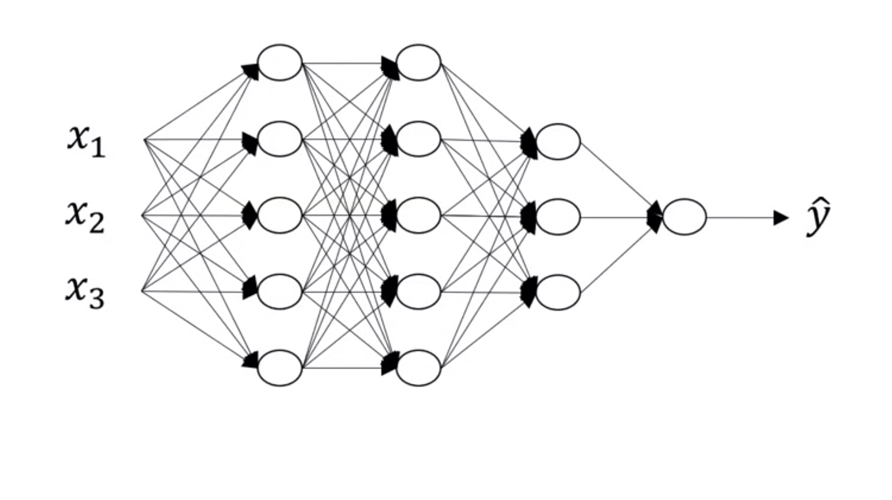

# Deep neural network 

### Notations

- $L = 4$ : #number of layers
- $n^{[l]}$: # number of units in layer $l$
- $a^{[l]}$ : activation in layer $l$
- $a^{[l]} = g^{[l]}(z^{[l]})$: activation function lin layer $l$
- $W^{[l]} = $ weights for $z^{[l]}$
- $b^{[l]} = $ bias for $z^{[l]}$
- $x = a^{[0]}$
- $\hat{y} = a^{[L]}$

### Shapes

- shape of $W$ : $(n^{[l]}, n^{[l-1]})$
- shape of $b$ : $(n^{[l]}, 1)$
- shape of $dw$ = shape of $W$
- shape of $db$ = shape of $b$
- shape of $Z^{[l]}, A^{[l]}, dZ^{[l]}, dA^{[l]}: $ $(n^{[l]}, m)$

### Tại sao cần deep learning

Mạng nơron sâu tạo liên hệ với dữ liệu từ đơn giản tới phức tạp. Ở từng lớp, nó cố tạo quan hệ với lớp trước đó, ví dụ:

- Ứng dụng nhận diện khuôn mặt (Face recognition): Hình ảnh => Các cạnh => Các bộ phận trên khuôn mặt => Các khuôn mặt => Khuôn mặt mong muốn.
- Ứng dụng nhận diện âm thanh (Audio recognition): Âm thanh => Các đặc trưng âm thanh ở mức độ thấp (sss,bb) => Phonemes $m$ vị => Từ => Câu.

Các nhà nghiên cứu nơron cho rằng mạng nơron sâu “tư duy” như não bộ (đơn giản ⇒ phức tạp). 

Khi bắt đầu ứng dụng, chúng ta chưa cần bắt đầu trực tiếp bằng nhiều lớp ẩn. Hãy thử giải pháp đơn giản nhất (chẳng hạn: Hồi quy logistic) rồi thử mạng nơron nông,...

### Xây dựng các blocks cho Deep Neural Network

Tại layer $l: W^{[l]}, b^{[l]}$

- **Forward**

  - Input: $a^{[l-1]}$
  - output: $a^{[l]}$
  - Equations: $z^{[l]} = W^{[l]}a^{[l-1]} + b^{[l]}$
  - then: $a^{[l]} = g^{[l]}(z^{[l]})$
  - -> **cache** $z^{[l]}, a^{[l-1]}$

- **Backward**

  - Input: $da^{[l]}$

  - output: 

    - $dz^{[l]} = da^{[l]}g'^{[l]}(z^{[l]})$

    - $dw^{[l]} = da^{[l]}a^{[l-1]} $

    - $db^{[l]} = $

    - $da^{[l-1]} = $

      

