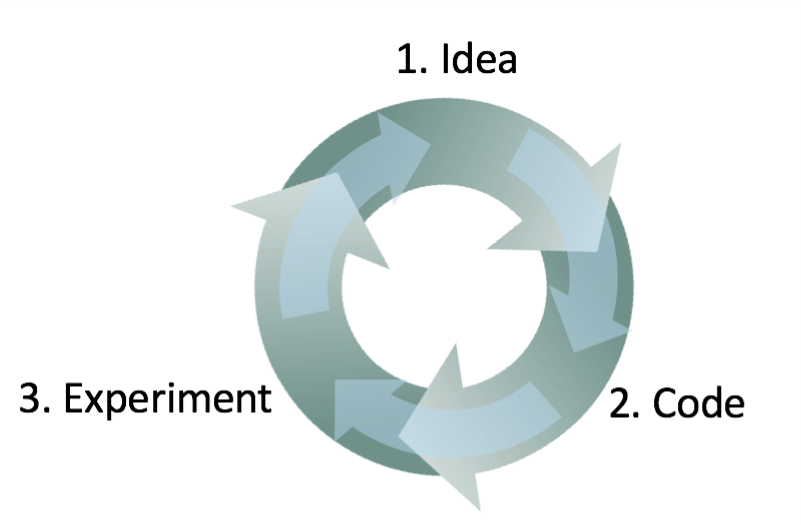

# Improving Deep Neural Networks: Hyperparameter tuning, Regularization and Optimization

## Practical aspects of Deep Learning

### Train/Dev/Test sets

- Việc có được những Hyperparameter trong ngay những lần thử nghiệm đầu tiên là điều không thể, do đó, khi giải quyết một vấn đề, chúng ta sẽ luôn xoay vòng qua các bước: `Idea ==> Code ==> Experiment`. Chúng ta sẽ phải đi qua vòng lặp này nhiều lần để tìm ra các hyperparameter của mình.

  

-  Dữ liệu sẽ được chia làm ba phần

  - Training set (phải là tập lớn nhất)
  - Cross Validation / Dev set
  - Test set

  Dữ liệu sẽ được huấn luyện trên `Training set` , sau đó dùng `Cross Validation/Dev set` để tối ưu hoá các Hyperparameters càng nhiều càng tốt. Sau khi mô hình đã sẵn sàng, dùng tập thử nghiệm để đánh giá.

- Tỉ lệ phân chia các tập:

  - Nếu kích thước tập dữ liệu từ 100 đến 1.000.000 => `Train/Dev/Test = 60/20/20`
  - Nếu kích thước tập dữ liệu lớn hơn 1.000.000 ==> `Train/Dev/Test = 98/1/1 or 99.5/0.25/0.25`

- Cần đảm bảo Dev set và test set có cùng một phân phối

  Ví dụ: Trong bài toán phân loại mèo thì, nếu training set là ảnh lấy từ mạng Internet, trong khi đó ảnh trong Dev/Test set lại là ảnh người dùng đưa lên, chúng sẽ không khớp. Vậy tốt hơn hết là nên đảm bảo rằng dev set và test set là trên cùng một phân phối

- Hoàn toàn có thể chỉ dùng Dev set mà không cần Test set.

### Bias/Variance

- **Bias** là sai số trên Training/Dev sets
- **Phương sai (Variance)** là sai số trên Test set. 
- Nếu mô hình không phù hợp (Logistic Regression of non liner data) sẽ có **Bias cao**
- Nếu mô hình Overfit thì sẽ có **Variance cao**
- mô hình ổn khi có độ cân bằng giữa **Bias** và **Variance**

Ngoài việc dùng đồ thị thì có môt cách khác để đánh giá được **Bias** và **Variance**

- High variance (Overfiting)
  - Training error: 1%
  - Dev error: 11%
- High Bias (Underfiting)
  - Training error: 15%
  - Dev error: 14%
- High bias (underfiting) and High variance (overfitting)
  - Traning error: 15%
  - Test error: 30%
- Best
  - Training error: 0.5%
  - Test error: 1%

Các giả định này đều đến từ sau số mức độ con người là 0%, tất cả lỗi đánh giá phải lấy lỗi con người làm cơ sở.

Lỗi con người ở đây là những bài toán mà ngay cả khi con người cũng có khả năng nhầm lẫn, chúng ta cần lấy con số đó làm tiêu chuẩn để đánh giá Bias và Variance xem chúng ta đang bị overfiting hay underfiting.

### Công thức cơ bản cho Machine Learning

- Với các bài toán có Bias cao (Sai số trên Training set cao)
  - Cố gắng làm cho Neural network của bạn lớn hơn (Size of hidden units / number of layers)
  - Thử nghiệm một model mới phù hợp với Data của bạn hơn
  - Sử dụng các thuật toán tối ưu hoá khác nhau
- Với các bài toán có Variance cao (Sai số trên test set)
  - Cần nhiều dữ liệu hơn
  - Thử regularization
  - Thử nghiệm model khác phù hợp với Data của bạn hơn
- Thời gian đầu của machine learning, chúng ta thường hướng tới sự cân bằng giữa Variance và Bias. Nhưng ngày nay, khi mà chúng ta đã có thêm nhiều công cụ để giải quyết vấn đề về Bias và Variance, nên nó sẽ thực sự hữu ích khi sử dụng Deep Learning.
- Đào tạo một neural network lớn hơn không bao giờ gây hại.

### Regularization

- Thêm Regularization vào trong NN sẽ giúp nó giảm phương sai (overfiting)

- Norm 1: $\parallel W \parallel = \text{SUM}(\left| W[i,j] \right|)$ # Sum of absolute values of all `w`

- Norm 2: $\parallel W \parallel ^{2} = \text{SUM}(\left| W[i,j]^2 \right|)$ # Sum of all `w` squared

  Ngooài ra, $\parallel W \parallel ^{2} = W^TW$  # $W$ is a vector

- Regularization for logistic regression:

  - Normal cost function: $J(w,b) = \frac{1}{m} \sum_{i=1}^{m}\mathcal{L(y_i, \hat{y}_i)}$
  - The L2 regularization version: $J(w,b) = \frac{1}{m} \sum_{i=1}^{m}\mathcal{L(y_i, \hat{y}_i)} + \frac{\lambda}{2m}\sum_{i=1}^{m}w_i^2$
  - The L1 regularization version: $J(w,b) = \frac{1}{m} \sum_{i=1}^{m}\mathcal{L(y_i, \hat{y}_i)} + \frac{\lambda}{2m}\sum_{i=1}^{m}|w_i|$
  - L1 regularization làm cho rất nhiều các $w$ tiến đến 0, do đó làm cho model size nhỏ hơn.
  - L2 thường xuyên được sử dụng hơn, nó không đưa $w$ về không, nhưng nó đưa $w$ tiến gần đến 0
  - $\lambda$ làm một **hyperparameter**

- Regularization for Neural Network:
  - Normal cost function: $J(W_1,b_1, ... , W_L, b_L) = \frac{1}{m} \sum_{i=1}^{m}\mathcal{L(y_i, \hat{y}_i)}$
  
  - The L2 regularization version: $J(W_1,b_1, ... , W_L, b_L) = \frac{1}{m} \sum_{i=1}^{m}\mathcal{L(y_i, \hat{y}_i)} + \frac{\lambda}{2m}\sum_{i=1}^{m}w_i^2$
  
  - Backpropagation in old way: `dw[1] = (from back propagation)`
  
  - In new way: `d[w1] = (from back propagation) + lambda/m * w[1] `
  
  - So, plugin in weight update step
    $$
    \begin{array}{rcl}
    W[1] & = & W[1] - \text{learning rate} * dw[1] \\
     & = & W[1] -  \text{learning rate} * ((\text{from back propagation}) + \frac{\lambda}{m} * w[1])\\
     & = & (1 - \text{learning rate} * \frac{\lambda}{m}) * w[1] - \text{learning rate} * (\text{from back propagation})
    \end{array}
    $$
    

