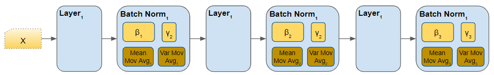
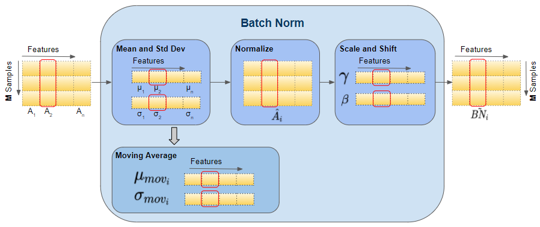

# Hyperparameter tuning, Batch Normalization and Programming Frameworks

## Hyperparameter turning

### Turning process

- Thứ tự các hyperparameters theo mức độ quan trọng cần điều chỉnh (Theo Andrew Ng)

1. Learning rate.
2. Momentum beta.
3. Mini-batch size.
4. No. of hidden units.
5. No. of layers.
6. Learning rate decay.
7. Regularization lambda.
8. Activation functions.
9. Adam `beta1`, `beta2` & `epsilon`.

- Rất khó để quyết định tham số nào là quan trọng nhất, nó tuỳ thuộc rất nhiều vào bài toán
- Như trong phần linear regression, chúng ta đã biết đến cách chia lưới, là tổ hợp các tham số và thử chúng, nhưng có những tham số quan trọng, có những tham số ít quan trọng hơn, cách này sẽ đưa ta đến một nhược điểm là chúng ta sẽ mất thêm nhiều lần thử đối với các tham số không quan trọng không cần thiết, vậy nên với những hệ thống có dữ liệu data lớn, đây thực sự sẽ trở thành vấn đề.
- Một cách khác để giaỉ quyết nhược điểm của việc chia lưới, là lấy mẫu ngẫu nhiên (không sử dụng lưới)
- Chúng ta có thể sử dụng: `Coarse to fine sampling scheme`: Cách này nghĩa là, sau khi chúng ta tìm được một tập những giá trị tốt nhất rồi, chúng ta có thể *zoom in* gần lại những giá trị đấy, và tìm kiếm thêm những điểm xung quanh.
- Những methods này hoàn toàn có thể làm một cách tự động.


### Using an appropriate scale (Thang đo phù hợp) to pick hyperparameters

Giả sử chúng ta có một phạm vi siêu tham số cụ thể từ "a" đến "b". Cần tìm kiếm các tham số phù hợp bằng cách sử dụng thang logarit thay vì thang tuyến tính:

Step 1, Tính:

- `a_log = log(a) # ví dụ: a = 0.0001 và a_log = -4`
- `b_log = log(b) # e.g. b = 1 then b_log = 0`

Sau đó

```python
r = (a_log - b_log) * np.random.rand() + b_log
# In the example the range would be from [-4, 0] because rand range [0,1)
result = 10^r
```


Giả sử muốn tính toán $\beta$  cho **momentum** 

Khoảng giá trị tốt nhất nằm trong khoảng 0.9 đến 0.999, vậy nên tìm khoảng cho $1 - \beta \in [0.001, 0.1]$  (1 - 0.9 and 1 - 0.999)

Sử dụng `a =0.001`, `b =0.1` tính:

```python
a_log = -3
b_log = -1
r = (a_log - b_log) * np.random.rand() + b_log
beta = 1 - 10^r   # because 1 - beta = 10^r
```

### Phương pháp turning Pandas và Caviar

:star: **Pandas**


Tên của phương pháp là Panda nghĩa là Con gấu trúc, Loài này đẻ rất ít và mỗi lần đẻ chúng chỉ đẻ một con và chăm sóc rất cẩn thận. 

Phương pháp lựa chọn hyperparameters này nghĩa là chúng ta sẽ điều chỉnh tham số qua từng ngày và theo dõi kết quả.

Cụ thể

:point_right: Ngày 0, lựa chọn tham số ngẫu nhiên và bắt đầu huấn luyện.

:point_right: Sau đó quan sát đồ thị học giảm dần ngày qua ngày

:point_right: Mỗi ngày bạn lại di chuyển tham số một chút ở trong quá trình huấn luyện

Phương pháp này dùng khi chúng ta có ít resource cho việc tính toán


:star: **Caviar - Trứng cá muối**

Tên của phương pháp nói đến trứng cá, loài này mỗi mùa sinh sản có thể sinh ra hàng trăm, hàng ngàn quả trứng, và vẫn hi vọng một hoặc một loạt trong số chúng có thể nở và sống sót.

Cụ thể trong việc lựa chọn hyperparameters, Nếu bạn có đủ resource, bạn có thể song song training rất nhiều model với các thông số khác nhau để qua đó có thể đưa ra đc những tham số hợp lý cho mô hình.


## Batch Normalization

Chuẩn hoá Batch tăng tốc độ học.

Trước kia chúng ta **chuẩn hóa đầu vào** bằng cách *trừ trung bình* và *chia cho phương sai*. Điều này giúp ích rất nhiều cho hình dạng của hàm chi phí và đạt điểm cực tiểu nhanh hơn. 

Câu hỏi đặt ra là: chúng ta có thể chuẩn hóa $A[l]$ để huấn luyện $W[l+1], b[l+1]$ nhanh hơn với bất kỳ lớp ẩn nào không? Chuẩn hóa batch sẽ trả lời điều này.

Đã có một số tranh luận về việc nên chuẩn hoá $A[l]$  hay chuẩn hoá $Z[l]$  (giá trị đứng sau Activation function hay gía trị đứng sau Activation). Theo Andrew Ng thì chuẩn hoá $Z[l]$ được thực hiện thường xuyên hơn (giá trị đứng trước activation function)

### Normalizing Activations in a network

- **Algorithm**:
  - Given `Z[l] = [z(1), ..., z(m)]`, i = 1 to m (ứng với từng đầu vào)
  - Compute `mean = 1/m * sum(z[i])`
  - Compute `variance = 1/m * sum((z[i] - mean)^2)`
  - Then `Z_norm[i] = (z[i] - mean) / np.sqrt(variance + epsilon)` (thêm `epsilon` để ổn định số nếu variance = 0)
    - Buộc các đầu vào cho một phân phối với mean = 0 và variance = 1
  - Then `Z_tilde[i] = gamma * Z_norm[i] + beta`
    - Làm cho các đầu vào thuộc về phân phối khác (với mean và variance khác)
    - **gamma** và **beta** là các tham số có thể học được của mô hình
    - Làm cho mạng nơ-ron học phân phối của các đầu ra. 
    - *Note:* if `gamma = sqrt(variance + epsilon)` and `beta = mean` then `Z_tilde[i] = z[i]`

**Note**

- **gamma** và **beta** là các tham số có thể học được từ mô hình, Vì vâỵ giả sử khi đang sử dụng gradient decent hoặc một số thuật toán khác như gradient decent của momentum ... bạn sẽ cập nhật tham số **gamma** và **beta** giống như việc cập nhật trọng số. trong mạng neural của bạn
- Một điều nữa khiến gamma và beta quan trọng cần phải có là, gamma và beta có thể điều chỉnh phân phối các $Z$ trong 1 lớp ẩn nào đó, đôi khi chúng ta không muốn 1 lớp ẩn mà các giá trị có mean = 0 hay variance =1, như trong ví dụ với hàm sigmoid, chúng ta muốn tận dùng nhiều hơn sự non-linear của hàm này, do đó gamma và beta là rất quan trọng để điều chỉnh.

### Fitting Batch Norm into a Neural network

[Bài viết gốc tham khảo (rất hay)](https://towardsdatascience.com/batch-norm-explained-visually-how-it-works-and-why-neural-networks-need-it-b18919692739)

Tất cả những gì có trong đoạn này chỉ là tóm tắt theo ý hiểu bằng tiếng việt

#### **Batch norm layer**




#### **Tính toán trong một batch norm**





#### **Batch norm hoạt động như thế nào?**

 Batch Norm chỉ là một lớp mạng khác được chèn vào giữa lớp ẩn và lớp ẩn tiếp theo. Công việc của nó là lấy các đầu ra từ lớp ẩn đầu tiên và chuẩn hóa chúng trước khi chuyển chúng làm đầu vào của lớp ẩn tiếp theo.


- Cũng như các lớp khác có các trọng số ($w, b$), batch norm layer cũng có các trọng số của riêng nó.

- Hai trọng số có thể học được là beta - $\beta$  và gamma - $\gamma$ 

- Hai giá trị không học được là Trung bình và phương sai

- Các bước xử lý dữ liệu:

  - :one: **Activation** Đây là đầu ra sau hàm kích hoạt của lớp trước được đưa vào làm inpurt cho batch norm
  - :two: Tính toán giá trị **trung bình - mean** - $\mu$ và **phương sai - variance** - $\sigma^2$
  - :three: **Normalize** - Chuẩn hoá, Tính toán giá trị chuẩn hoá cho mỗi Activation Feature vector sử dụng Mean và Variance tương ứng. Tại đây giá trị chuẩn hoá có Mean = 0 và Variance = 1
  - :four: **Scale and Shift**: Bước này là một bước ngoặt to lớn làm lên sức mạnh của batch norm. Không giống như với lớp đầu vào yêu cầu tất cả các gía trị chuẩn hoá phải có phương sai đơn vị và trung bình bằng không. Batch norm cho phép các giá trị của nó được chuyển dịch. Nó thực hiện điều này bằng cách nhân các giá trị chuẩn hóa với một hệ số gamma và thêm vào đó một hệ số beta. Dựa vào đây, mỗi lớp Batch Norm có thể tối ưu hóa các yếu tố tốt nhất cho chính nó, và do đó có thể thay đổi và chia tỷ lệ các giá trị chuẩn hóa để có được các dự đoán tốt nhất.
  - :five: **Moving Average** Đây là tính Giá trị trung bình theo cấp số nhân - Exponential Moving Average (EMA) của mean và variance, đây là phần thêm, nó không được đưa vào tính toán, nhưng nó được save lại dành cho Inference phase

  

#### **Batch norm - Vector shape**


#### **Vì sao Batch Norm hoạt động**

Lý do đầu tiên cũng giống lý do chúng ta chuẩn hóa X. 

Lý do thứ hai là chuẩn hóa batch giảm vấn đề thay đổi (dịch chuyển) giá trị đầu vào.

Chuẩn hóa batch thực hiện một số điều chuẩn:

- - Mỗi mini-batch bị co giãn theo trung bình/phương sai đã tính của nó.
  - Điều này thêm nhiễu vào giá trị Z[l] trong minibatch đó. Tương tự như dropout, điều này thêm nhiễu vào các kích hoạt của từng lớp ẩn (Điều này có một chút hiệu ứng điều chuẩn).
  - Do sử dụng kích thước minibatch lớn hơn nên nhiễu đang được giảm và do đó có hiệu ứng điều chuẩn.
  - Đừng căn cứ vào chuẩn hóa batch làm điều chuẩn. Nó dành cho chuẩn hóa các đơn vị ẩn, kích hoạt và tăng tốc độ học. Còn để điều chuẩn, hãy dùng các kỹ thuật điều chuẩn khác (L2 hoặc dropout).

#### **Batch Norm at Test time**

Khi huấn luyện một mạng nơ-ron với chuẩn hóa Batch, chúng ta tính trung bình và phương sai của mini-batch.

Trong quá trình kiểm tra/sử dụng mô hình, chúng ta cần xử lý từng ví dụ một. Trung bình và phương sai của ví dụ không có ý nghĩa. Vì vậy, cần tính giá trị ước tính của phương sai và trung bình để sử dụng ở thời điểm kiểm tra.

Có thể sử dụng trung bình có trọng số trên các mini-batch. Chúng ta sẽ sử dụng các giá trị đã ước tính của trung bình và phương sai để kiểm tra, và phương pháp này còn được gọi là "Running average". 


## Multi-class Classification

### Softmax Regression

- Tất cả các ví dụ trước đó, chúng ta đều nói về phân loại nhị phân, nghĩa là chỉ có đúng hoặc sai, 0 hoặc 1. Có một loại tổng quát hoá của hồi quy logistic là hồi quy Softmax được dùng cho phân loại/hồi quy đa lớp

- Ví dụ: nếu chúng ta đang phân loại theo lớp: dog, cat, baby chick và none of that.

  - Dog `class = 1`

  - Cat `class = 2`

    Baby chick `class = 3`

    None `class = 0`

    Biểu diễn vectơ dog `y = [0 1 0 0]`

    Biểu diễn vectơ cat `y = [0 0 1 0]`

    Biểu diễn vectơ baby chick `y = [0 0 0 1]`

    Biểu diễn vectơ none `y = [1 0 0 0]`

- Ký hiệu: 
  - `C = số lượng class`
  - Phạm vi của lớp là `(0, ..., C-1)`
  - Trong lớp đầu ra `Ny = C`

- Mỗi giá trị C ở lớp đầu ra chứa xác suất của ví dụ thuộc về từng lớp.

- Ở lớp cuối, chúng ta cần kích hoạt hàm kích hoạt Softmax thay vì hàm sigmoid.

- Phương trình kích hoạt Softmax:

  - $t = e^{Z[l]}$ `# shape(C, m)  `
  - $A[l] = \frac{e^{Z[l]}}{\sum t}$ `# shape(C, m), sum(t) - tổng của các t cho từng ví dụ (shape (1, m))`

  

### Training một softmax classifier

- Có một kích hoạt là **hard max** nhận 1 cho giá trị lớn nhất và 0 cho các giá trị khác (**np.max** trên trục tung nếu đang dùng NumPy).
- Tên **Softmax** bắt nguồn từ việc làm mềm (**soften**) các giá trị mà không làm cứng (hard) như hard max. **Softmax** là tổng quát hóa của hàm kích hoạt logistic cho C lớp. Nếu C = 2, softmax giảm xuống hồi quy logistic.
- Hàm mất mát sử dụng với softmax: $\mathcal{L}(y, \hat{y}) = - \sum_{j= 0}^{C-1} y[j]*log(\hat{y})$
- Hàm chi phí sử dụng softmax: $\mathcal{J}(w[1], b[1],  \cdots ) = - \frac{1}{m} \sum_{i=0}^{m}\mathcal{L}(y, \hat{y})$
- Back propagation cho softmax: $dZ[l] = \hat{y} - y$
- Đạo hàm của softmax: $\hat{y} * (1 - \hat{y})$

**Ví dụ:**


## Code

