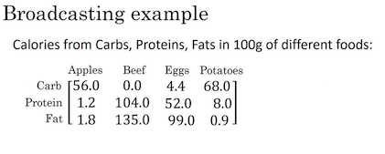

# Numpy and Vectorization

## Vectorization

> - Đây là phương pháp nhằm loại bỏ các `for` loop trong code. Giúp chương trình chạy nhanh hơn.
> - Hàm `dot` thư viện NumPy sử dụng vectơ hóa mặc định. Vectơ hóa có thể thực hiện trong CPU hoặc GPU qua phép toán SIMD, nhưng nhanh hơn trong GPU.
> - Hãy tránh vòng lặp for khi có thể, và phần lớn các phương thức thư viện NumPy là phiên bản vectơ hóa.

Ví dụ: Tính **Logistic regression derivatives**


Từ công thức để tính đạo hàm:

$d(a) = \frac{d \mathcal{L}}{da} = \frac{d }{da}(-(y\log(a) + (1-y)\log(1-a))) = -\frac{y}{a} + \frac{1-y}{1-a}$

$d(z) = \frac{d \mathcal{L}}{dz} = a -y$

$d(w_1) = x_1 * d(z)$

$d(w_2) = x_2 * d(z)$

$d(b) = d(z)$

- <mark><strong>Non-Vectorization</strong></mark>

```python
# Đạo hàm
J = 0; dw1 = 0; dw2 = 0; db = 0;
for i = 1 to m
    # Forward
    z(i) = w1*x1(i) + w2*x2(i) + b
    a(i) = Sigmoid(z(i))
    J += -(y(i)*log(a(i)) + (1-y(i))*log(1-a(i)))

    # Backward pass
    dz(i) = a(i) - y(i)
    dw1 += dz(i) * x1(i)
    dw2 += dz(i) * x2(i)
    db += dz(i)

J = J/m
dw1 = dw1/m
dw2 = dw2/m
db = db/m
```

- <mark><strong>Vectorization</strong></mark>

Chúng ta  có đầu vào là ma trận 

- $\textbf{X} \in \mathrm{R}^{n\times m}$
- $ \textbf{y} \in \mathrm{R}^{m\times 1}$ 
- $\textbf{z} = \textbf{w}^{T}\times \textbf{X} + \textbf{b}$
- $w = \begin{bmatrix} w^{(1)} \\ w^{(2)} \\ \vdots  \\ w^{(n)} \end{bmatrix} \in \mathbf{R}^{n \times 1}$

$$
\left[ z^{(1)}, z^{(2)} \cdots , z^{(m)} \right] = w^{T} 
\begin{bmatrix}
\vdots  & \vdots  & \vdots & \vdots\\
 x^{(1)} & x^{(2)} & \cdots   & x^{(m)} \\
 \vdots & \vdots & \vdots & \vdots
\end{bmatrix} 

+ \left[ b, b, \cdots , b \right]
$$

$m$ training example : $\{(x^{(1)}, y^{(1)}), (x^{(2)}, y^{(2)}), ..., (x^{(m)}, y^{(m)})\}$

$n$ features

```python
z = np.dot(w.T, x) + b # Z shape is (1, m)
a = 1/(1 + np.exp(-z)) # A shape is (1,m)

dz = a - z						# dz shape is (1,m)
dw = np.dot(x, dz.T)/m	# dw shape is (Nx, 1)
db = np.sum(dz)/m

# Gradient decent`
w := w - alpha * dw
b := b - alpha * db


```

## Broadcasting in Python



Cần tính tỷ lệ % Calo từ Carb, Protein, Fat.

Ví dụ với cột đầu tiên

- Cần phải tính tổng lượng calos từ 100g Apples (tổng cột 1 = 59 cal)
- Cần tính tỉ lệ, ví dụ với Carb thì % = $\frac{56.0}{59} = 94.9$

Giả sử ma trận trên tương ứng là $\mathbf{A} \in \mathbf{R}^{(3\times4)}$

```python
cal = A.sum(axis=0)				# Tổng theo cột, muốn tổng theo hàng thì thay axis = 1
percentage = 100 * A / cal.reshape(1,4) 
# Có thể không cần gọi reshape(1,4), vì bản thân ma trận cal đã có kích thước 1x4 rồi
# Việc gọi reshape chỉ là để đảm bảo.
```

## A note on Python/Numpy vector

