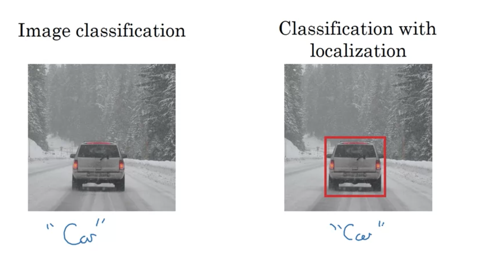
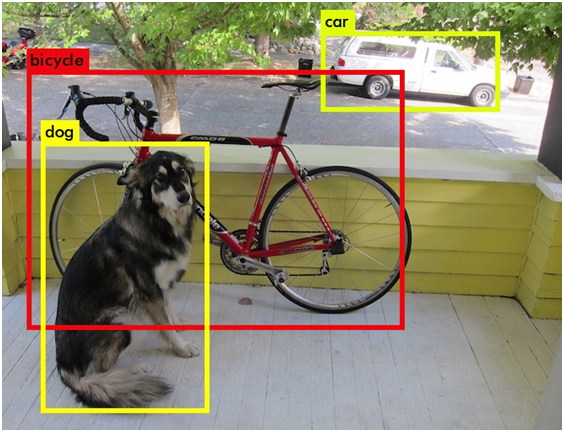

# Object Detection

Để phát hiện được đối tượng cần qua 2 bước riêng biệt:

- Xác định vị trí (localization)
- Phát hiện đối tượng (Detection)

## Object Localization

:point_right: Phân biệt bài toán phân loại hình ảnh thông thường và phân loại hình ảnh cùng với localization:

​		:star: Phân loại hình ảnh thông thường dùng cả bức ảnh và coi nó là 1 lớp

​		:star: Phân loại hình ảnh có localization thì là từ một bưc ảnh lớn, chúng ta xác định được vật (một phần trong bức ảnh lớn), kết quả đầu ra thường kèm theo một bounding box xác định vị trí cuả vật thể trong ảnh.

:point_right: Phát hiện đối tượng:

​		:star: Cho một hình ảnh, chúng ta muốn phát hiện tất cả các đối tượng trong hình ảnh đó thuộc về một lớp cụ thể và tìm vị trí của chúng. Một ảnh có thể chứa nhiều hơn một đối tượng với các lớp khác nhau.

